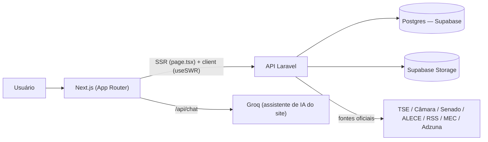

<p align="center">
    
</p>

<p align="center">
    <em>Seu voto, sua escolha, seu futuro.</em>
</p>

<p align="center">
    
</p>

# Votus — Frontend

## Sobre o projeto

O **Votus** é uma plataforma de transparência e educação política desenvolvida para o **Ceará Científico 2026**. Este repositório é o **frontend** (Next.js): consome a API do Votus ([backend em Laravel](https://github.com/NotCrazyDog-hub/votus-general-api)) e apresenta os dados de forma organizada, responsiva e acessível. Não contém lógica de negócio própria — toda coleta, normalização e persistência de dados vive no backend; a única excessão é o assistente de IA do site, que roda numa rota própria deste repositório (ver [Integração com IA](#-integração-com-ia)).

## Principais funcionalidades

**Área pública**

- Parlamentares do Ceará em exercício: deputados federais, senadores e deputados estaduais (listagem + perfil com proposições, comissões e métricas legislativas);
- Executivos em exercício: presidente/vice da República e governador/vice do Ceará;
- Candidatos às eleições de 2026 (presidente, governador, senador, deputado federal, deputado estadual), com navegação por região/estado e busca por nome, número ou partido;
- Painel de notícias políticas, resumidas automaticamente por IA e organizadas por categoria/relevância;
- **"Você Sabia?"** — explicações geradas por IA sobre temas de política, cada uma com um quiz de 5 perguntas;
- Mapa de Cargos Políticos — o que faz cada cargo e como eles se relacionam entre si;
- Assistente de IA (botão flutuante) para perguntas sobre política e sobre os parlamentares cadastrados;
- Propostas cidadãs: cadastro e votação (apoio/reprovação) da comunidade, com comentários;
- Formulário de sugestões anônimo sobre o próprio projeto;
- Gerador de santinhos eleitorais personalizados (exportação em PDF);
- Conteúdo voltado à juventude: vagas de emprego/estágio e concursos públicos;
- Busca de universidades e cursos de graduação (dados do MEC);
- Interface responsiva (mobile e desktop) e otimizada para SEO (sitemap, robots, Open Graph).

**Painel administrativo** (`/admin`, autenticado)

- Gestão de notícias: disparo manual de coleta, acompanhamento e remoção, com drenagem automática da fila de resumo por IA;
- Gestão de explicações/quiz: criação (a partir de links de fontes confiáveis), geração por IA, revisão/edição do conteúdo e publicação;
- Gestão de fontes confiáveis usadas na geração de explicações;
- Gestão de propostas e comentários da comunidade (remover, restaurar, excluir definitivamente);
- Gestão de sugestões recebidas, com exportação em PDF e cadastro/edição das perguntas da pesquisa;
- Moderação de concursos públicos importados por automação externa (aprovar, rejeitar, publicar).

## Tecnologias utilizadas

- [Next.js](https://nextjs.org/) 16.3.2 (App Router, Turbopack);
- [React](https://react.dev/) 19.2;
- [TypeScript](https://www.typescriptlang.org/);
- [Tailwind CSS](https://tailwindcss.com/) v4 (CSS-first, sem arquivo de config separado);
- [SWR](https://swr.vercel.app/) — cache e revalidação de dados no cliente, com dois hooks próprios (`useSsrPaginatedList`/`useSsrDetail`, ver [Gerenciamento de dados](#-gerenciamento-de-dados));
- [Lucide React](https://lucide.dev/) — ícones;
- [jsPDF](https://github.com/parallax/jsPDF) — geração de PDFs (santinhos e relatório de sugestões do admin);
- [Groq SDK](https://www.npmjs.com/package/groq-sdk) — usado só pela rota própria do assistente de IA (`src/app/api/chat`).

## 🚀 Começando

### Pré-requisitos

- [Node.js](https://nodejs.org/) 20 ou superior (`@types/node` ^20);
- npm;
- Git.

### Instalação

```bash
git clone https://github.com/guisouzsa/votus_front.git
cd votus_front
npm install
```

### Variáveis de ambiente

Copie `.env.example` para `.env.local` e preencha:

```env
NEXT_PUBLIC_API_URL=http://localhost:8000
NEXT_PUBLIC_SITE_URL=http://localhost:3000
CHAT_API_KEY=
```

Em produção, `NEXT_PUBLIC_API_URL` aponta para a API implantada (ex.: `https://votus-core.onrender.com`) e `NEXT_PUBLIC_SITE_URL` para o domínio público do frontend.

Há também uma variável opcional, usada pela mesma rota de chat mas **ausente do `.env.example`**:

```env
# Opcional — sobrescreve o modelo padrão da Groq ("openai/gpt-oss-20b")
GROQ_MODEL=
```

### Executando

```bash
npm run dev
```

A aplicação estará disponível em `http://localhost:3000`.

## 📜 Scripts disponíveis

| Comando | Descrição |
|---|---|
| `npm run dev` | Inicia o servidor de desenvolvimento (Turbopack) |
| `npm run build` | Gera a versão de produção |
| `npm run start` | Executa a aplicação já compilada |
| `npm run lint` | Roda o ESLint (flat config, `eslint-config-next`) |

Não há suíte de testes configurada neste repositório (nenhum Jest/Vitest/Playwright, nenhum script `test`).

## 🗺️ Rotas

### Padrão de busca de dados

A maioria das listagens e páginas de detalhe segue o mesmo padrão: um `page.tsx` **Server Component** busca a primeira página (ou o item) direto da API antes de renderizar (`export const revalidate = 60`, ISR), e repassa o resultado como prop para um Client Component (`*Client.tsx`), que usa `useSsrPaginatedList`/`useSsrDetail` (ver [Gerenciamento de dados](#-gerenciamento-de-dados)) para não refazer esse fetch no navegador. Páginas marcadas "client-only" abaixo não têm essa busca no servidor — o dado só chega via `useSWR` no navegador.

### Listagens (SSR)

| Rota | Serviço | Conteúdo |
|---|---|---|
| `/DeputadosPage` | `getDeputies` | Deputados federais do Ceará |
| `/SenadoresPage` | `getSenators` | Senadores do Ceará |
| `/DeputadosEstaduaisPage` | `getAllStateDeputies` | Deputados estaduais (ALECE) |
| `/GovernadoresPage` | `getGovernors` | Governador/vice do Ceará |
| `/PresidentePage` | `getPresidents` | Presidente/vice da República |
| `/CandidatosPage/[office]` | `getCandidates` | Candidatos 2026 por cargo (`office`: presidente/governador/senado/deputado-federal/deputado-estadual), com navegação por região/estado |
| `/JuventudePage` | `getOpportunities` + `getPublicOpportunities` | Vagas e concursos públicos |
| `/UniversidadesPage` | `getCourseOfferings` | Ofertas de curso por estado/município/curso |

### Detalhe (SSR)

| Rota | Serviço |
|---|---|
| `/ShowDeputadosPage/[externalId]` | `getDeputy` |
| `/ShowSenadoresPage/[externalId]` | `getSenator` |
| `/ShowDeputadosEstaduaisPage/[slug]` | `getStateDeputy` |
| `/ShowGovernadoresPage/[id]` | `getGovernor` |
| `/ShowPresidentePage/[id]` | `getPresident` |
| `/CandidatosPage/[office]/[id]` | `getCandidate` |
| `/noticias/[id]` | `getNewsItem` |
| `/explicacao/[id]` | `getExplanation` |

### Client-only (fetch só no navegador)

| Rota | Conteúdo |
|---|---|
| `/ExplicacoesPage` | Mapa de Cargos Políticos (dado estático, sem API) |
| `/PainelNoticiasPage` | Painel de notícias |
| `/explicacao` | Listagem "Você Sabia?" |
| `/PropostasPage` | Propostas cidadãs, votos e comentários |
| `/SantinhoPage` | Gerador de santinho |
| `/SugestoesPage` | Formulário de sugestões |

### Estáticas / institucionais

| Rota | Conteúdo |
|---|---|
| `/` | Landing page pública |
| `/InicialPage` | Dashboard inicial (shell estático, ISR) |
| `/SobreNosPage` | Sobre o projeto e a equipe |

### Administrativas (`/admin/**`, autenticadas)

| Rota | Descrição |
|---|---|
| `/admin/login` | Login (grava token no `localStorage`) |
| `/admin` (layout + page) | Guarda de autenticação client-side + dashboard |
| `/admin/noticias` | Gestão de notícias |
| `/admin/explicacoes`, `/admin/explicacoes/[id]` | Gestão de explicações/quiz e fontes confiáveis |
| `/admin/propostas` | Moderação de propostas e comentários |
| `/admin/sugestoes` | Gestão de sugestões e perguntas da pesquisa |
| `/admin/juventude` | Moderação de concursos públicos |

Todas as rotas `/admin/*` recebem o header `X-Robots-Tag: noindex, nofollow` via `next.config.ts` (o layout é Client Component e não pode exportar `metadata`).

### Redirecionamentos

`next.config.ts` mantém 4 redirects (não permanentes) de pastas de rota renomeadas, para não quebrar link antigo salvo/compartilhado: `/Inicial → /InicialPage`, `/Juventude → /JuventudePage`, `/Universidades → /UniversidadesPage`, `/Painelnoticias → /PainelNoticiasPage`.

### Rota de API interna

| Rota | Método | Descrição |
|---|---|---|
| `src/app/api/chat/route.ts` | POST | Assistente de IA do site — monta um prompt com o roster de parlamentares do Ceará, aplica rate limit em memória (10 req/min por IP, 5/hora por `X-Visitor-Id`) e chama a Groq diretamente |

Não existe nenhuma outra rota `route.ts` no projeto.

## 🔌 Comunicação com a API

Toda chamada ao backend passa por `src/services/apiClient.ts` (`apiGet`/`apiPost`/`apiPatch`/`apiPut`/`apiDelete`), usando `NEXT_PUBLIC_API_URL` como base. Cada domínio tem seu próprio arquivo de serviço em `src/services/`:

| Serviço | Endpoints do backend |
|---|---|
| `deputiesService.ts` | `/api/deputies`, `/api/deputies/{id}` |
| `senatorsService.ts` | `/api/senators`, `/api/senators/{id}` |
| `stateDeputiesService.ts` | `/api/state-deputies`, `/api/state-deputies/{slug}` |
| `executivesService.ts` | `/api/president`, `/api/president/{id}`, `/api/governors`, `/api/governors/{id}` |
| `candidatesService.ts` | `/api/{president,governor,senate,federal-deputy,state-deputy}-candidates` (+ `/{id}`) |
| `newsService.ts` | `/api/news`, `/api/news/{id}` |
| `explanationService.ts` | `/api/explanations`, `/api/explanations/{id}` |
| `proposalsService.ts` | `/api/proposals`, `/{id}`, `/{id}/vote`, `/{id}/comments` |
| `suggestionsService.ts` | `/api/suggestion-questions`, `/api/suggestions` |
| `universitiesService.ts` | `/api/course-offerings` (+ `/options/municipalities`, `/options/courses`) |
| `opportunitiesService.ts` | `/api/opportunities`, `/api/public-opportunities` |
| `metricsService.ts` | `/api/santinhos`, `/api/site-visits` |
| `adminService.ts` | Todos os endpoints `/api/admin/*` (login e CRUDs de notícias/propostas/sugestões/explicações/fontes confiáveis/concursos) |

Rotas administrativas exigem o token Bearer emitido por `/api/admin/login` (guardado via `src/lib/adminAuth.ts`) e são consumidas apenas pelo painel `/admin`.

## ⚡ Gerenciamento de dados

As listagens e páginas de detalhe usam **SWR**, mas com dois hooks próprios em vez de `useSWR` puro, porque a primeira página/o item já vêm do servidor (SSR) junto com o HTML:

- **`useSsrPaginatedList`**: evita que o `isLoading` nativo do SWR ignore o dado vindo do SSR (o que mostraria um skeleton à toa) e desativa a revalidação automática ao montar (`revalidateIfStale: false`), que senão disparava um fetch redundante do mesmo dado que acabou de chegar pelo servidor.
- **`useSsrDetail`**: mesmo princípio, para páginas de item único — sem ele, a página de detalhe buscava de novo no cliente o mesmo item que o servidor já tinha resolvido para o `generateMetadata`.

`SWRProvider.tsx` configura o comportamento global (sem revalidar no foco da janela, deduplicação de 30s).

## 🤖 Integração com IA

A Groq é usada em dois pontos **distintos e independentes**:

- **Assistente de IA do site** (botão flutuante `FloatingAIButton`): rota própria deste repositório (`src/app/api/chat`), que chama a Groq diretamente com o roster de parlamentares do Ceará como contexto (`src/data/team.ts`/dados reais da API, cacheados em memória por 5 min). Usa `CHAT_API_KEY` e `GROQ_MODEL`, configurados só neste frontend.
- **Backend**: a coleta/resumo de notícias e a geração de explicações + quiz rodam inteiramente no [backend Laravel](https://github.com/NotCrazyDog-hub/votus-general-api), com suas próprias chaves Groq (`GROQ_API_KEY_1`..`5`) — não têm relação com `CHAT_API_KEY`.

A IA tem caráter informativo/educacional; respostas não substituem as fontes oficiais citadas na própria interface (ver `DataSourceNote.tsx`).

## 🧩 Estrutura do projeto

```text
votus_frontend/
├── src/
│   ├── app/                     # Rotas (App Router) — ver seção Rotas
│   │   └── api/chat/            # Única rota de API interna (assistente de IA)
│   ├── components/              # Componentes reutilizáveis
│   │   ├── cargos/              # Seções da página "Mapa de Cargos Políticos"
│   │   └── admin/               # Componentes exclusivos do painel admin
│   ├── services/                # Chamadas à API do backend (fetch + tipos em types.ts)
│   ├── hooks/                    # useSsrPaginatedList, useSsrDetail, useSantinhoCandidates
│   ├── lib/                      # Utilitários (auth do admin, PDF, SEO, prefetch, etc.)
│   └── data/                     # Dados estáticos (regiões/UFs, cargos políticos, equipe)
├── public/                       # Imagens, ícones e elementos do santinho
├── next.config.ts                # Headers, redirects e remotePatterns de imagem
├── package.json
└── tsconfig.json
```

### Componentes por domínio (visão geral)

- **Parlamentares/candidatos**: `LegislatorPhoto`, `LegislatorCardSkeleton`, `LegislatorDetailSkeleton`, `LegislatorFilterFrame`, `LegislativeTimeline`, `ProposicoesList`, `RegionStateSelector`, `StatCard`.
- **Notícias**: `NewsCard`, `HeroArticle`, `NewsSection`, `NewsArticlePage`, `NewsPanelSkeleton`, `NewsPreviewSection`, `RelevanceTabs`.
- **Propostas**: `ProposalCard`, `ProposalCardSkeleton`, `ProposalCategoryPicker`, `ProposalComments`, `ProposalFormModal`.
- **Santinho**: `SantinhoForm`, `SantinhoPreview`, `SantinhoExportModal`, `SantinhoCandidateInput`.
- **Cargos** (`src/components/cargos/`): `OfficeSelector`, `OfficeFactSheet`, `OfficeActions`, `OfficeComparison`, `BranchesOfGovernmentDiagram`, `VoteToOfficeMapping`.
- **Landing pública**: `HeroSection`, `FeaturesSection`, `HowItWorksSection`, `IaUseSection`, `AudienceCategoriesSection`, `ParrotBannerSection`, `PreviewSectionsCarousel`, `DevelopersSection`, `CTASection`, `LandingHeader`, `Footer`.
- **Navegação/layout geral**: `Sidebar`, `MobileBottomNav`, `OfficeQuickNav`, `WovenRibbon`, `DashboardHeader`, `WelcomeHeader`, `PageTransitionOverlay`, `Pagination`, `SearchBar`, `LoadingState`, `InfoTooltip`.
- **Telemetria**: `SiteVisitPing`.
- **Admin** (`src/components/admin/`): `AdminNav`, `AdminMobileNav`, `AdminSearchInput`, `AdminStatCard`, `AdminState`, `AnswersDonut`, `ConfirmDialog`.

> Observação: `src/components/sibar2.tsx` não é importado por nenhuma página ou componente — é código morto, mantido no repositório mas sem uso atual.

## 🔗 Arquitetura



Frontend e backend são desenvolvidos e implantados separadamente — a interface pode evoluir sem alterar a lógica do backend, e vice-versa. O frontend não acessa o Postgres/Supabase diretamente; tudo passa pela API.

## 🔗 Repositório do backend

- **Código:** https://github.com/NotCrazyDog-hub/votus-general-api
- **API em produção:** https://votus-core.onrender.com

## 📖 Fontes de dados

O frontend não coleta dados — apenas exibe o que a API fornece. As fontes oficiais usadas pelo backend (TSE, Câmara dos Deputados, Senado Federal, ALECE, Agência Brasil, Poder360, MEC, Adzuna) estão documentadas no [README do backend](https://github.com/NotCrazyDog-hub/votus-general-api#-fontes-oficiais-dos-dados) e citadas na própria interface via `DataSourceNote.tsx`.

## 🌐 Deploy

Hospedado na [Vercel](https://vercel.com/), com deploy automático por branch (preview por push, produção na branch principal).

```bash
npm run build
npm run start
```

Variáveis de ambiente a configurar na plataforma de deploy: `NEXT_PUBLIC_API_URL`, `NEXT_PUBLIC_SITE_URL`, `CHAT_API_KEY` (e, opcionalmente, `GROQ_MODEL`).

## 🔐 Segurança

- O token do painel admin é guardado em `localStorage` (`src/lib/adminAuth.ts`) e enviado como `Authorization: Bearer` — não há cookie de sessão.
- `/admin/**` é protegido só no cliente (guarda em `admin/layout.tsx`, que redireciona para `/admin/login` sem token) — a proteção real dos dados é do backend (Sanctum); por isso o header `X-Robots-Tag: noindex, nofollow` existe à parte, via `next.config.ts`, para impedir indexação mesmo sem bloqueio de acesso no servidor do frontend.
- Votos e comentários de propostas usam um UUID anônimo por navegador (`src/lib/visitorId.ts`, header `X-Visitor-Id`), sem dado de identificação real.
- A rota `/api/chat` aplica rate limit em memória (por IP e por `X-Visitor-Id`) antes de chamar a Groq, para conter abuso/custo.
- `next.config.ts` restringe `images.remotePatterns` a hosts e paths específicos (Câmara, Senado, bucket Supabase, site da ALECE, site do Governo do CE) — nenhum domínio arbitrário é otimizado pelo `next/image`.

## 📐 Convenções

- Pastas de rota (`src/app/*`) ficam em português, seguindo o conteúdo do produto; a maioria usa o sufixo `Page` (`DeputadosPage`, `CandidatosPage`, etc.) — as 4 exceções históricas já foram padronizadas com redirect de compatibilidade.
- Código interno (services, hooks, componentes, tipos) é majoritariamente em inglês; o conteúdo exibido ao usuário e os valores vindos da API continuam em português.
- Cada página SSR segue o padrão `page.tsx` (Server Component, busca inicial) + `*Client.tsx` (Client Component, `useSsrPaginatedList`/`useSsrDetail`) — ver [Rotas](#-rotas).
- Tipos ficam centralizados em `src/services/types.ts` (não há `src/types/`).

## ⚠️ Limitações conhecidas

- Não há suíte de testes automatizados (unitário, integração ou end-to-end) neste repositório.
- A proteção de `/admin/**` é feita no cliente (verificação de token antes de renderizar) — sem JavaScript ou com manipulação direta, a tela pode "aparecer" antes do redirect; os dados em si só são obtidos se a API aceitar o token, então não há exposição de dado real, mas a UX de bloqueio não é à prova de bypass client-side.
- `src/components/sibar2.tsx` é código morto (não referenciado em nenhum lugar).
- `GROQ_MODEL` é uma variável de ambiente real, usada em `src/app/api/chat/route.ts`, mas não está listada no `.env.example`.
- O "Mapa de Cargos Políticos" (`/ExplicacoesPage`) usa dados estáticos (`src/data/politicalPositions.ts`), não a API — qualquer mudança de conteúdo exige alterar e reimplantar o frontend, não é editável pelo admin.

## 🏗️ Decisões arquiteturais

- A implementação atual utiliza **dois hooks SWR próprios** (`useSsrPaginatedList`/`useSsrDetail`) em vez de `useSWR` direto em cada página, porque o comportamento padrão do SWR (ignorar `fallbackData` no `isLoading`, revalidar ao montar mesmo com dado fresco do SSR) causava skeleton e fetch duplicado logo após a hidratação.
- A implementação atual utiliza **proteção de `/admin` só no client** (guarda em `layout.tsx`, sem middleware do Next.js), porque não existe `middleware.ts` no projeto — a decisão de autenticação real está delegada inteiramente ao backend (Sanctum), e o frontend só evita mostrar a tela sem necessidade.
- A implementação atual utiliza **pastas de rota em português com sufixo `Page`**, mantendo o conteúdo do produto como identificador de URL, em vez de uma convenção só em inglês — trade-off deliberado entre legibilidade de URL para o público-alvo e consistência técnica pura.
- A implementação atual utiliza **geração de PDF 100% no cliente** (santinho e relatório de sugestões, via jsPDF), em vez de gerar no backend, para não depender de uma biblioteca de PDF no servidor Laravel nem transferir arquivo gerado de volta — o backend só registra que a geração aconteceu.

## ✅ Checklist do frontend

- [x] Todas as rotas (`src/app/**`) listadas e conferidas contra o código real
- [x] Services cruzados contra os endpoints reais do backend
- [x] Hooks, lib e dados estáticos documentados a partir do código
- [x] Variáveis de ambiente documentadas por nome (incluindo a que falta no `.env.example`)
- [x] `next.config.ts` (headers, redirects, remotePatterns) descrito fielmente
- [x] Nenhuma funcionalidade, rota ou componente inventado
- [x] Limitações conhecidas descritas como tal, não omitidas

---

<p align="center">
    Desenvolvido pela equipe do Votus.
</p>
